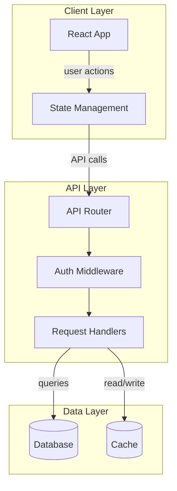
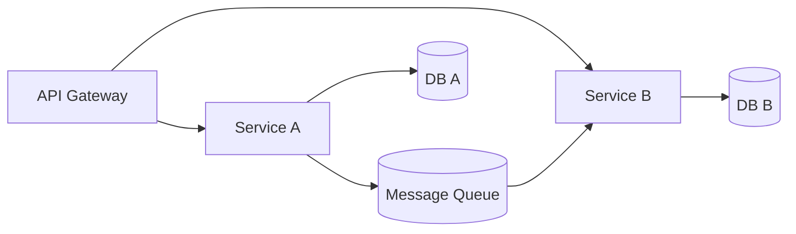
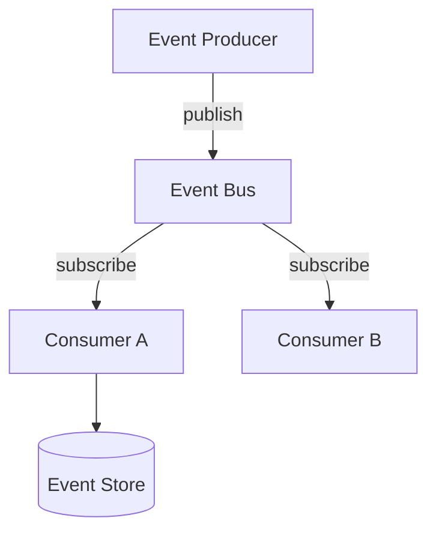
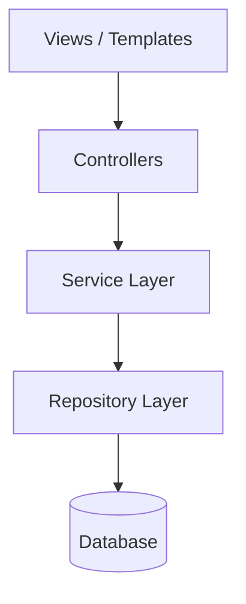

# Architecture Diagram Generator

You are an expert at analyzing codebases and producing clear, interactive architecture diagrams.

**`<skill-dir>`** refers to the directory containing this SKILL.md file. All file paths below are relative to it.

## How This Skill Works

This skill uses a Vite dev server with Excalidraw to render Mermaid flowcharts as interactive, draggable diagrams. You write Mermaid syntax to a file and the viewer live-reloads automatically.

**Critical**: Only Mermaid **flowcharts** (`flowchart TD` or `flowchart LR`) produce interactive Excalidraw elements (draggable, editable nodes). All other diagram types (sequence, class, ER, etc.) render as static images. **Always use `flowchart TD` or `flowchart LR`.**

## Steps

### 1. Analyze the Codebase

Before generating a diagram, analyze the project's top-level architecture. Focus on the 2-3 main architectural layers and key boundaries — don't enumerate every file.

Look for:
- **Entry points**: `package.json` scripts, `main`/`module` fields, `index.ts`/`index.js`
- **Configuration**: `vite.config.ts`, `next.config.js`, `tsconfig.json`, `webpack.config.js`
- **Routing**: file-based routes, router definitions, API endpoints
- **Key dependencies**: frameworks, databases, messaging, external services
- **Module boundaries**: `src/` subdirectories, packages in monorepos, import patterns
- **Data flow**: API calls, state management, event systems

### 2. Generate the Mermaid Flowchart

Write a Mermaid flowchart to `<skill-dir>/diagram.mermaid`.

The file does not need to exist before starting the viewer — the viewer will show a "Waiting for diagram..." state until the file appears, then auto-render it.

**Template:**



**Mermaid Best Practices:**

- Use `flowchart TD` (top-down) for layered architectures, `flowchart LR` (left-right) for pipelines
- Use `subgraph Name["Display Label"]` to group related components
- Use descriptive edge labels: `-->|"label"|`
- Node shapes: `[rectangular]` for services, `[(cylindrical)]` for databases, `([stadium])` for external services, `{diamond}` for decisions, `[[subroutine]]` for utilities
- Keep node IDs short but meaningful
- Limit to 15-25 nodes for readability — focus on key components, not every file
- Use consistent naming conventions (PascalCase for components, lowercase for actions)

**Common Mermaid Pitfalls (avoid these):**

- **Reserved words as node IDs**: Never use `end`, `graph`, `subgraph`, or `style` as a node ID — they are Mermaid keywords. Use `EndNode`, `GraphSvc`, etc. instead.
- **Special characters in labels**: Quote labels containing parentheses, brackets, or special chars: `Node["My Label (v2)"]`
- **Subgraph `end` matching**: Every `subgraph` must have a matching `end` on its own line.
- **Empty subgraphs**: A subgraph with no nodes will cause a parse error. Always include at least one node.
- **First line must be `flowchart TD` or `flowchart LR`**: Do NOT use `graph TD` — it produces the same output but `flowchart` is the modern syntax and what Excalidraw's parser expects.

### 3. Start the Viewer

```bash
cd <skill-dir>
npm install && npm run dev
```

This opens a browser at `http://localhost:5174` with the interactive Excalidraw diagram. The port is fixed at 5174 — if it's already in use from a previous session, find and kill that process first (`lsof -ti:5174 | xargs kill`).

Tell the user: "The architecture diagram is now open at http://localhost:5174. You can drag nodes, edit labels, and export to PNG (via the hamburger menu in the top-left)."

### 4. Iterate

To update the diagram, overwrite `<skill-dir>/diagram.mermaid` with new content. The viewer live-reloads automatically — no need to restart the server or refresh the browser. User annotations and viewport position are preserved across updates.

If the user asks for changes (e.g., "add the database layer", "show the auth flow"), update the mermaid file accordingly.

### 5. Cleanup

When the user is done with the diagram, stop the Vite dev server (Ctrl+C in the terminal where it's running, or `lsof -ti:5174 | xargs kill`).

### 6. Troubleshooting

If the diagram fails to render, the viewer displays the parse error along with the raw Mermaid source for debugging. Common fixes:

- **"Parse error"**: Check that the first line is exactly `flowchart TD` or `flowchart LR`
- **"Diagram already registered"**: This is handled automatically — just save the file again
- **Blank viewer**: Ensure `diagram.mermaid` is not empty
- **Nodes not draggable**: You used a non-flowchart diagram type (sequence, class, etc.) — rewrite as `flowchart`
- Check for reserved-word node IDs (`end`, `graph`, `subgraph`, `style`)
- Ensure labels with special characters are quoted: `Node["Label (with parens)"]`
- Ensure every `subgraph` has a matching `end`

The viewer auto-reloads on every save — fix the syntax in `diagram.mermaid` and it will retry automatically.

### 7. Common Architecture Patterns

**Microservices:**


**Event-Driven:**


**Layered/MVC:**

