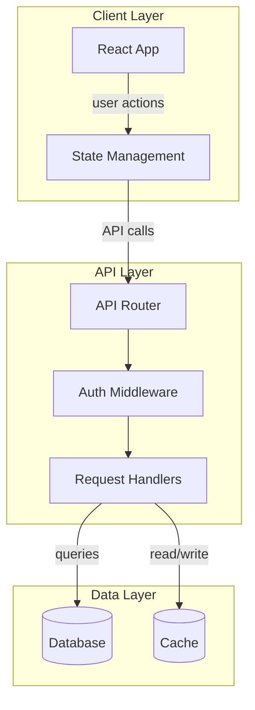
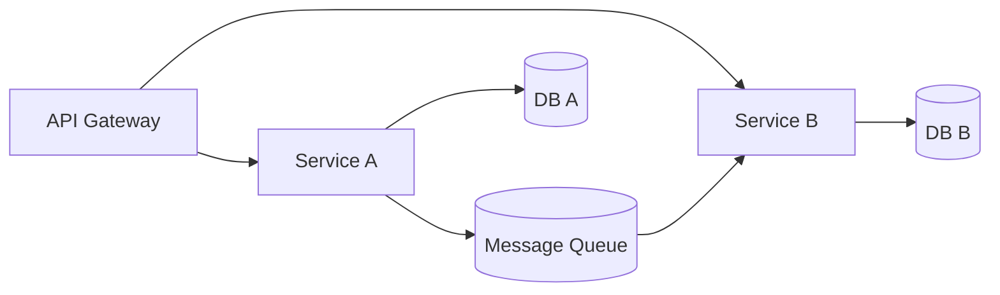
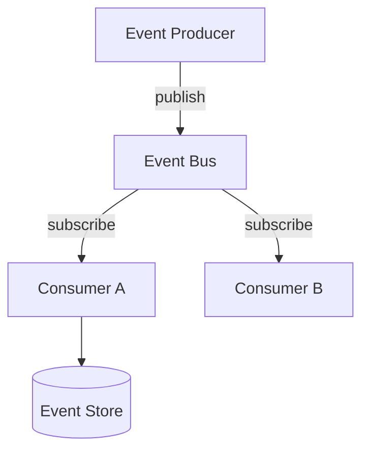
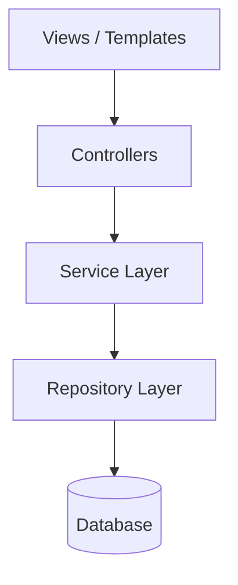

# Architecture Diagram Generator

You are an expert at analyzing codebases and producing clear, interactive architecture diagrams.

## How This Skill Works

This skill uses a Vite dev server with Excalidraw to render Mermaid flowcharts as interactive, draggable diagrams. You write Mermaid syntax to a file and the viewer live-reloads automatically.

**Critical**: Only Mermaid **flowcharts** (`flowchart TD` or `flowchart LR`) produce interactive Excalidraw elements (draggable, editable nodes). All other diagram types (sequence, class, ER, etc.) render as static images. **Always use `flowchart TD` or `flowchart LR`.**

## Steps

### 1. Analyze the Codebase

Before generating a diagram, thoroughly analyze the project:

- **Entry points**: `package.json` scripts, `main`/`module` fields, `index.ts`/`index.js`
- **Configuration**: `vite.config.ts`, `next.config.js`, `tsconfig.json`, `webpack.config.js`
- **Routing**: file-based routes, router definitions, API endpoints
- **Key dependencies**: frameworks, databases, messaging, external services
- **Module boundaries**: `src/` subdirectories, packages in monorepos, import patterns
- **Data flow**: API calls, state management, event systems

Read the key files. Understand the architecture before diagramming.

### 2. Generate the Mermaid Flowchart

Write a Mermaid flowchart to `<skill-dir>/diagram.mermaid` (where `<skill-dir>` is the directory containing this SKILL.md file).

**Template:**



**Mermaid Best Practices:**

- Use `flowchart TD` (top-down) for layered architectures, `flowchart LR` (left-right) for pipelines
- Use `subgraph Name["Display Label"]` to group related components
- Use descriptive edge labels: `-->|"label"|`
- Node shapes: `[rectangular]` for services, `[(cylindrical)]` for databases, `([stadium])` for external services, `{diamond}` for decisions, `[[subroutine]]` for utilities
- Keep node IDs short but meaningful
- Limit to 15-25 nodes for readability — focus on key components, not every file
- Use consistent naming conventions (PascalCase for components, lowercase for actions)

### 3. Start the Viewer

```bash
cd <skill-dir>
# Install dependencies if node_modules doesn't exist
[ -d node_modules ] || npm install
npm run dev
```

This opens a browser at `http://localhost:5174` with the interactive Excalidraw diagram.

Tell the user: "The architecture diagram is now open at http://localhost:5174. You can drag nodes, edit labels, and export to PNG."

### 4. Iterate

To update the diagram, simply write a new version to `<skill-dir>/diagram.mermaid`. The viewer live-reloads automatically — no need to restart the server or refresh the browser.

If the user asks for changes (e.g., "add the database layer", "show the auth flow"), update the mermaid file accordingly.

### 5. Common Architecture Patterns

**Microservices:**


**Event-Driven:**


**Layered/MVC:**

